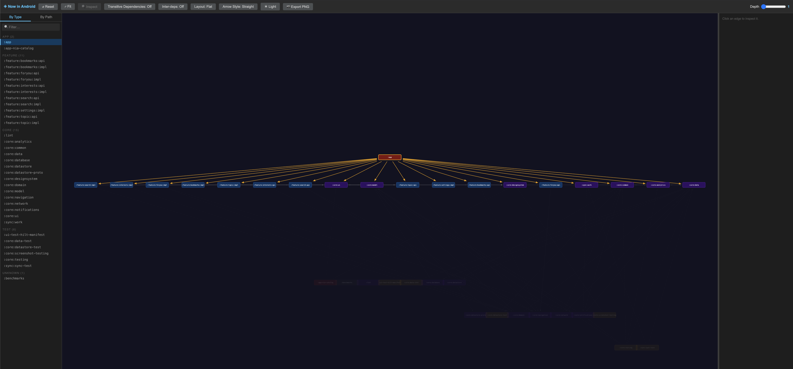
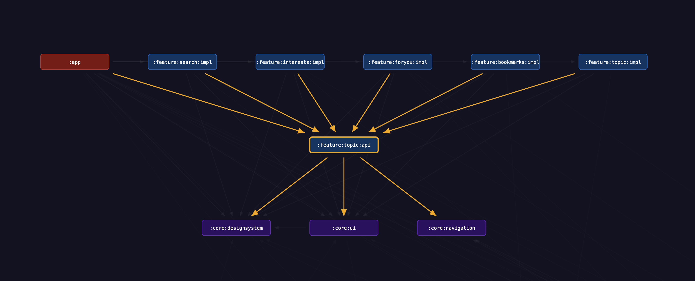
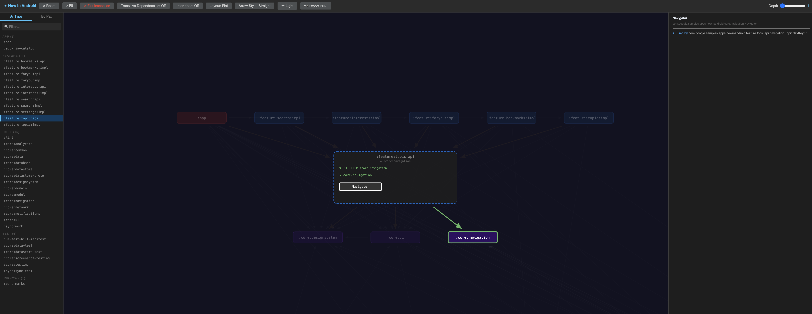
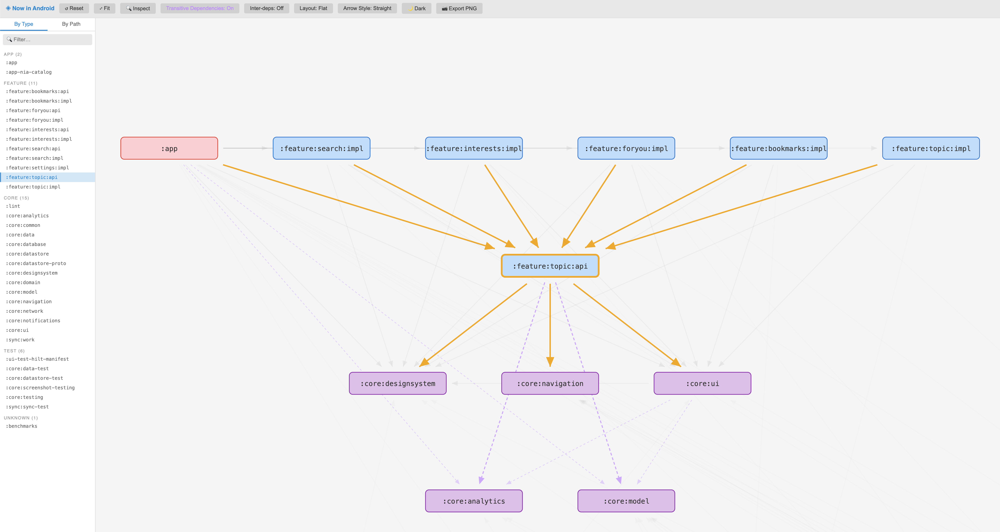

# Simple Dependency Analyzer

A Gradle plugin that generates an interactive, self-contained HTML report visualizing your multi-module project's dependency architecture. It doesn't just show you which modules depend on each other — it shows you *why*, by tracing module-level edges down to the exact classes involved.



## Features

### Module Graph


- **Automatic module type detection** — app, feature, core, data modules are color-coded based on applied plugins and naming conventions
- **Focus mode** — click a module to focus on its neighborhood; dependencies are placed below, dependents above
- **Depth control** — slider to adjust how many layers of dependencies are visible
- **Cycle detection** — circular dependencies are highlighted in red with visual badges
- **Animated layout transitions** — smooth animations when focusing, unfocusing, or changing depth

### Class-Level Inspection


- **Bytecode analysis** — scans compiled `.class` files using ASM to discover actual class references
- **Kotlin inline function detection** — parses SMAP debug info to find dependencies through inlined code
- **Relationship-focused inspection** — right-click a module to inspect it, then click another module to see exactly which classes are involved in the dependency
- **Package grouping** — boundary classes are grouped by package with expandable/collapsible pills
- **Detail panel** — click a class to see full dependency details including which classes use it or are used by it
- **Inline dependency markers** — dependencies through Kotlin inline functions are visually distinguished with dashed borders and "(inline)" tags

### Visualization Controls


- **Dark / Light theme** — toggle between themes; all graph elements adapt
- **PNG export** — export the current view at 2x resolution with context-aware filenames
- **Layout modes** — switch between Flat (BFS) and Deep (longest-path) subgraph layouts
- **Arrow styles** — toggle between straight and orthogonal edge routing
- **Transitive dependencies** — toggle to show purple dashed arrows revealing transitive dependency chains; click to see the shortest path
- **Inter-dependency highlight** — show all edges between modules in the visible neighborhood
- **Mouse wheel zoom** — scroll to zoom, ctrl+scroll to pan horizontally
- **Lasso selection** — drag on the background to select multiple modules
- **Resizable detail panel** — drag the panel edge to resize

### Smart Defaults
- **Auto-focuses the first app module** alphabetically on startup
- **Extracts app name** from `AndroidManifest.xml` for the toolbar title and export filenames
- **Filters generated classes** — Hilt, Dagger, DataBinding, and other generated classes are excluded from analysis
- **Filters container projects** — implicit parent modules with no plugins are excluded from the graph

## Setup

In your root `build.gradle.kts`:

```kotlin
plugins {
    id("io.github.rcosteira79.simple-dependency-analyzer") version "1.0.0"
}
```

<details>
<summary>Development setup (building from source)</summary>

### Using `includeBuild`

In your project's `settings.gradle.kts`:

```kotlin
pluginManagement {
    includeBuild("/path/to/simple-dependency-analyzer/gradle-plugin")
}
```

In your root `build.gradle.kts`:

```kotlin
plugins {
    id("io.github.rcosteira79.simple-dependency-analyzer")
}
```

### Using `mavenLocal`

Build and publish locally:

```bash
cd gradle-plugin
./gradlew publishToMavenLocal
```

Then in your project's `settings.gradle.kts`:

```kotlin
pluginManagement {
    repositories {
        mavenLocal()
        gradlePluginPortal()
    }
}
```

And in your root `build.gradle.kts`:

```kotlin
plugins {
    id("io.github.rcosteira79.simple-dependency-analyzer") version "1.0.0"
}
```

</details>

## Usage

### Full analysis (with class-level inspection)

```bash
./gradlew generateDependencyGraph
```

This compiles all modules and scans the bytecode. The report is generated at `build/dep-graph/index.html` with a clickable `file://` link printed in the terminal.

### Module-level only (fast, no compilation)

```bash
./gradlew generateDependencyGraph -PmodulesOnly=true
```

Skips compilation and class analysis. The report shows only the module-level graph without class inspection capabilities.

### Known limitation: Gradle configuration cache

The plugin accesses `project` at execution time, which is incompatible with Gradle's configuration cache. If you're using Gradle 9+ (which enables configuration cache by default), either:

- Run with `--no-configuration-cache`:
  ```bash
  ./gradlew generateDependencyGraph --no-configuration-cache
  ```
- Or if you see stale/incorrect results, clear the cache first:
  ```bash
  rm -rf .gradle/configuration-cache
  ```

Configuration cache support is planned for a future release.

## Configuration

In your root `build.gradle.kts`:

```kotlin
dependencyGraph {
    // Android build variant to analyse (default: "debug")
    variant = "debug"

    // Override the inferred module type for any module
    // Valid values: app, feature, core, data, unknown
}
```

Per-module type override (in a module's `build.gradle.kts`):

```kotlin
dependencyGraph {
    moduleType = "feature"
}
```

## How It Works

1. **Module analysis** — walks the Gradle project graph to discover modules and their dependency declarations
2. **Type inference** — classifies each module as app, feature, core, or data based on applied plugins and naming conventions
3. **Bytecode scanning** — uses [ASM](https://asm.ow2.io/) to read compiled `.class` files and extract class references (superclass, interfaces, fields, methods, annotations, instructions)
4. **Inline detection** — parses Kotlin SMAP debug info embedded in `.class` files to discover dependencies through inline functions
5. **Boundary computation** — cross-references per-module class data to identify boundary classes involved in cross-module edges
6. **Report generation** — produces a self-contained HTML file with embedded D3.js/dagre visualization and all data as JSON

## Tech Stack

- **Kotlin** — plugin implementation
- **ASM 9.7** — bytecode analysis
- **kotlinx-serialization** — JSON serialization
- **D3.js** — graph rendering and interactions
- **dagre** — automatic graph layout
- **JUnit 5** — testing
- **Gradle TestKit** — integration testing

## License

[MIT](LICENSE)
